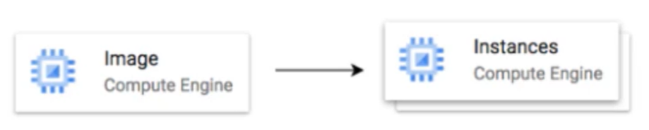
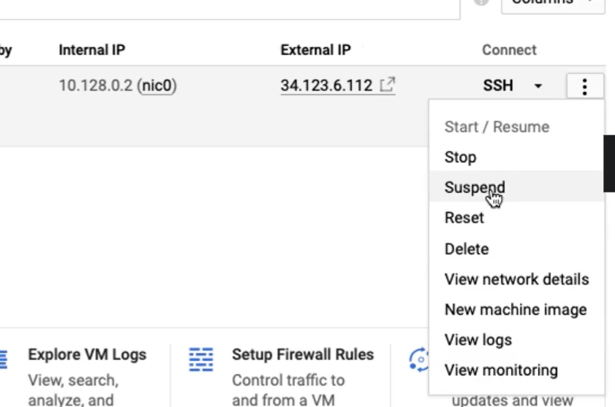
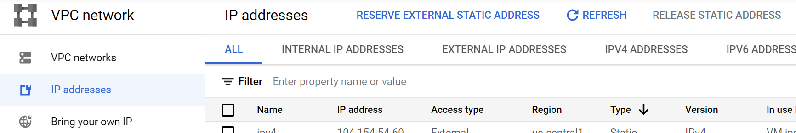
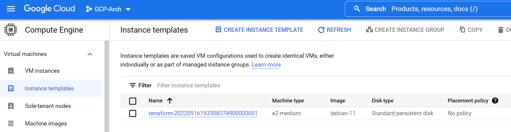
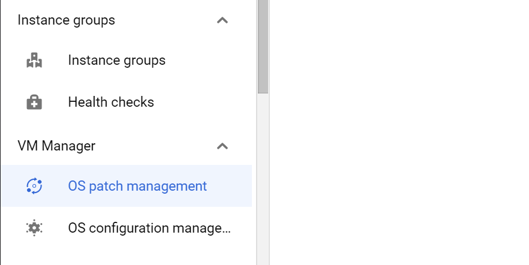

# Google Compute Engine
https://www.udemy.com/course/google-cloud-professional-cloud-architect-certification/learn/lecture/26121408#overview

## Udemy notes

### 12. Understanding Machine types and Images in GCE

#### Machine Families
* General purpose E2, N2, N2D, N1. Best price-performance ratio: webapps, servers, Small/medium dbs, dev envs
* Memory Optimised M2, M1. Large in-memory databases, analytics
* Compute-optimised - C2.  Gaming applications
* You can change the machine type (incl )

#### Machine Types
* How much cpu, memory, disk we want, e.g. e2-standard-2 family-type of workload - cpus

#### What OS?  

* Public Images: Provided & maintained by Google or Opensource communities
* Custom images: created by own projects

#### In Console

* Check for internal ip, external ip and ssh in if you need

### 15 Internal/External IPs
* External - public, Internet-addressable
  * cannot have the 2 same extranal ips
  * when vm stopped, eip is lost
* Internal -  private, Intranet-addressable
  * 2 different intranets CAN have 2 same internal ips
* All VMs have at least 1 internal ip
* 
### 17 Static IP Address
* Static ip address needs to be in the same region as VM
* You are billed for both using and not using sip. Not using it is much more expensive - release it!
* In console, go to VPC Networks > External IP Address to create and attach it

### 20 Instance Template
* create template to specify all vm instance details - machine type, image, labels, startup script
* create vm instances and migs
* cannot be updated - only copy/modify
* can specify img family - uses latest version, e.g. debian 9
* In console: 

### 21 Custom Image
* reduces boot up time, as don't have to install software over and over
* can be created from an instanced, persistent disk, snapshot, another image, file in Cloud Storage
* can be shared across all projects
* can deprecate old images
* can be customized to adhere to security standards (hardening)
* custom image better than startup script => already includes all the software

## Scenarios

#### What do you need to create a VM instance?
1. Project
2. Billing Account
3. Compute Engines API enabled

#### What if you want dedicated hardware (for compliance, security etc)
1. Use Sole-Tenant nodes
2. Created node group
3. Add nodes

#### If I have thousands of VMs and I want to automate OS patch management, OS inventory management, OS config management etc?
1. Go to VM Manager - can do OS patch manager

#### Log into VM to install software
1. SSH into VM

#### Don't want to expose VM to Internet
1. Do not assign External IP address

#### Allow HTTP traffic to your VM
1. Configure firewall rules