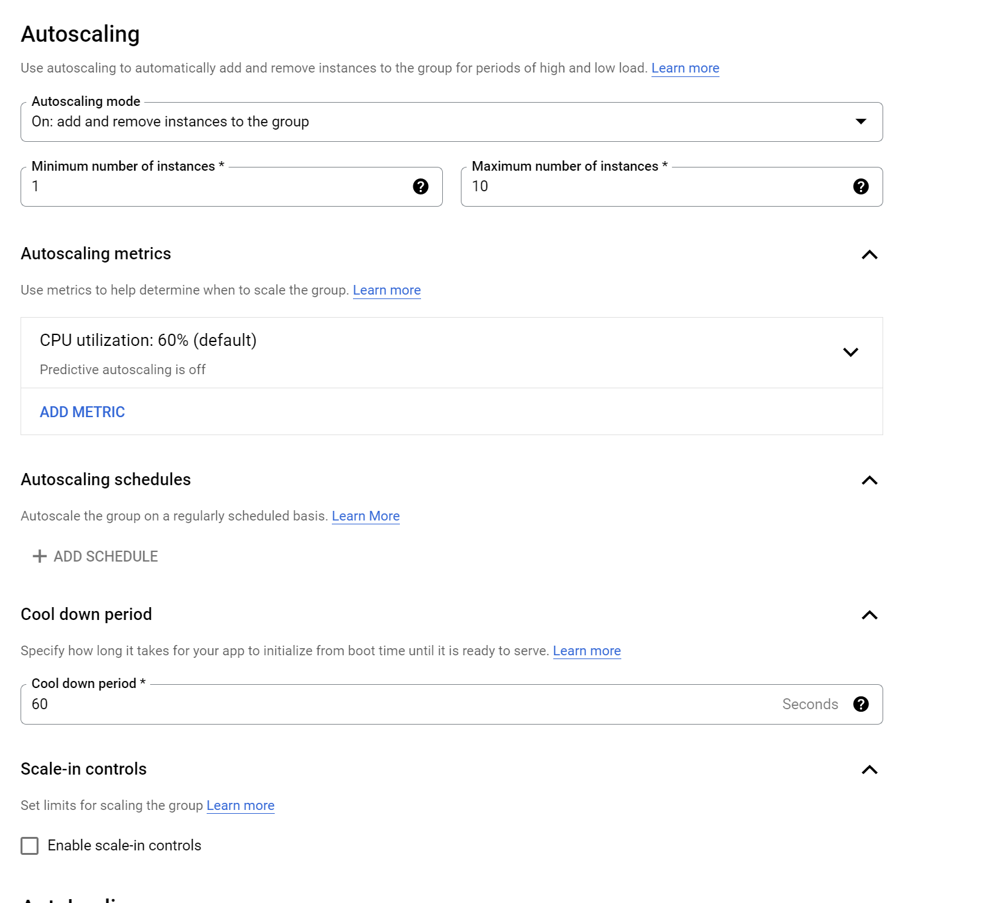
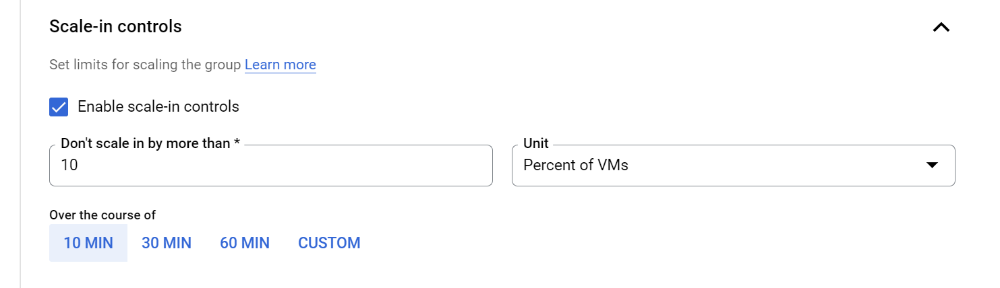
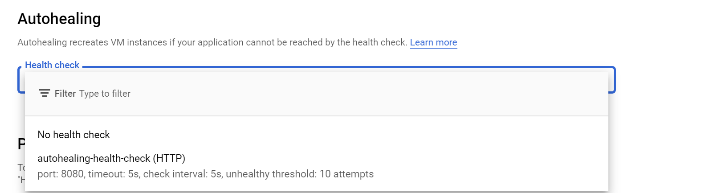
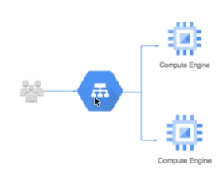
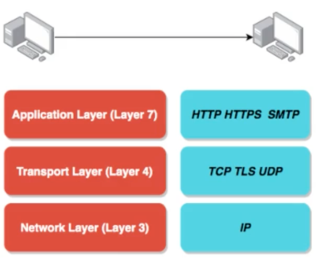
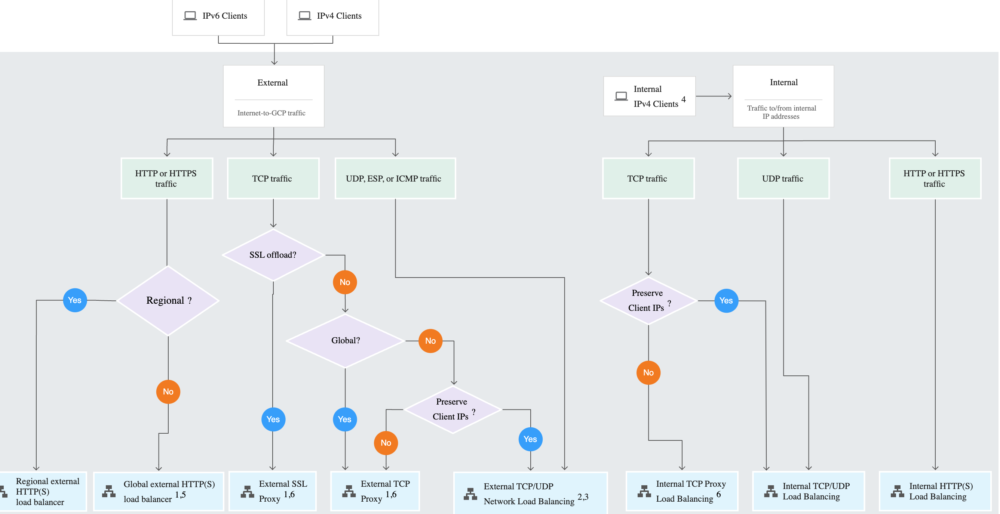
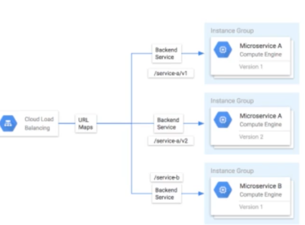

# Instance Groups and Load Balancing
https://www.udemy.com/course/google-cloud-professional-cloud-architect-certification/learn/lecture/26121360#overview

### 26. Getting Started with Instance Groups

#### Instance Groups
* Instance group - group of VMs managed as a single entity
* 2 Types:
  * Managed - identical VMs using a template. Autoscale, auto heal (based on passed/failed health checks) as a single group, managed releases.
  * Unmanaged - different configuration for VMs in the same group - different images, different hardware. No autoscale, auto heal etc. 
* Location: Zonal or Regional

####  Managed Instance Groups
* Identical VMs using instance template
* Can maintain N instances (failed ones auto-replaced)
* Autoscaling
* Can add load balancer
* Can be multi-zonal for regional Migs
* Release new app versions without downtime
  * Rolling updates - new version release step by step
  * Canary deployment - test new verions with a group before rollout

### 27. Creating Migs
* Instance template is mandatory
* Configure 
  * autoscaling with min/max amount of instances 
  
    * based on CPU utilization target, lb utilization target or any other metric
  * can schedule
  * various scale-in controls - e.g. no more than 10% VMs every 10 minutes
  
  * autohealing: healthcheck with initial delay (how long before accepting traffic)
  

* There is no real tf setting to make it managed - instead it becomes managed as configuration is added. 
  * use stateful_disk to make a mig stateful
* When creating from console, managed/unmanaged can be specified

### 29. Updating Migs
* Rolling update - gradual update of instances in an IG to the new instance template; need new template and(optional) template for canary testing
* Specify how the update shuold be done
  * proactive (now) or some time later (opportunistic)
  * how should the update happen? 
    * Maximum surge - how many added at any point
    * Maxumium unavailable - how many instance can be offline during update
* Rolling restart/replace: gradual restart or replace of all instances in the group
  * Configure maximum surge, maxiumum unavailable and action (restart/replace)
* Update can be done via 'update VM' in console

### 30. Getting started with Load Balancing
* Distributes user traffic across instances of an application
  * single or multi region
  * health checks, only routes to healthy instances
  * auto scaling
    * global load balancing with a single ip
  * high availability
  * resiliency
  
   

### 31. Understanding Protocols

* Protocol = common language at various layers
* Network layer - 3  - transfers  0s and 1s, IP
  * transfers bites. Unreliable
* Transport Layer - 4 - responsible for transferring the bits and bytes properly, TCP,UDP
  * TCP Reliability > Performance (checks everything)
  * UDP Performance > Reliability (ok losing info) - video streaming, gaming apps
* Application layer - 7  - REST API calls, emails, HTTP
  * http stateless request response cycle
  * https, secure http
  * web apps/rest/api/email server, ftp => still use TCP at network
* Each layer makes use of layers beneath it
* Most apps use L7, other directly at network layer (high performance)

### 33. Understanding cloud load balancing terminology
* backend = group of end points that receive traffic from the load balancer
* frontend  = ip address, port, protocol of the lb for the client requests (for ssl, need certs)
* host and path rules  - define rules redirecting traffic to different backends
  * based on path, host or http headers or methods (post, get)
* SSL/TLS Termination/Offloading
  * if client to load balancer external
    * https recommended, achieve that by assiging ssl cert to lb
  * lb to instances: internal. http is ok, https preferred
  * SSL Termination/Offloading means ssl communication terminated at load balancer

### 35. Which load balancer to use?

* If lb is internal, the choice just depends on type of traffic tcp/udp or http
* If lb is external, depends on 
  * type of traffic
  * regional vs global
  * ssl offload
  * need to preserve client ips
* new http lb has advanced traffic management

#### 36. Exploring features of lbs
| Load Balancer            |                Traffic                 |       Proxy | Destination ports              |
|--------------------------|:--------------------------------------:|------------:|:-------------------------------|
| External http(s)         |     global, external, http, https      |       proxy | http on 80, 8080, https on 443 |
| Internal http(s)         |    Regional, internal, http, https     |       proxy | http on 80, 8080, https on 443 |
| SSL proxy                | global, external, tcp with ssl offload |       proxy | loads                          |
| TCP proxy                |   global, external, tcp without ssl    |       proxy | loads                          |
| External Network TCP/UDP |     regional, external, tcp or udl     | passthrough | any                            |
| Internal TCP/UDP         |     regional, internal, tcp or udp     | passthrough | any                            |

#### 37. Load balancing across MIGs in multiple regions
* If mig regional, instances can be in different zones (high availability)
* If want even more availability, create multiple regional migs in the same projects
* https load balancing can distribute load to multiple migs behind a single external ip addess 
  * requests directed to nearest region
* Only sends traffic to healthy instances
  * auto restart if healthcheck fails
  * if all backends in region fail => traffic routed to other regions
  
#### 38 Explore Microservices Scenarios - Versioning and Multiple Regions
* Configuring HTTP(S) load balancer
  * Backend configuration - backend service that directs incoming traffic to
    * backend service - group of backends or bucket  OR
    * backend - an instance group
  * Host and path rules - determine how the traffic is directed. If no rules=> default back end service
    * url maps, e.g. /service-a => back end A, /service-b => back end B
    * need premium tier for global routing, else regional
  * Frontend configuration - ip address, protocol, port
* CAN serve traffic across various versions, e.g. MIGA has version 1, MIG2, has version 2 and the back end services associated
  * Backends are regional, so would have to create 2 for 2 MiGs in different regions
    